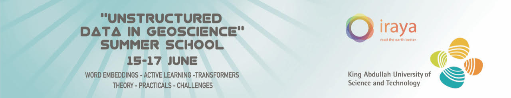

Welcome to KAUST and Iraya's virtual summer school on Utilising unstructured data in geoscience. Over three days, we will give 
you an introduction to what is Natural Language Processing, how the geoscience industry is leveraging it, and the new
avenues that are up for exploration. 

In this repository we have shared our codes for the tutorials as well as guidance on setting this up on your 
workstation. The lectures which accompany the tutorials will be available as video recordings in the near future.

Getting started on your machine
-------------------------------

To create the environment which has all the necessary python packages pre-installed, in your terminal in this folder 
directory run:

`conda env create -f environment.yml`

This creates a conda environment named "mlg_summer_school". Before we begin you will need to activate this environment.
To do so, in your terminal run the command:

`conda activate mlg_summer_school`

Prerequisites
-------------
All participants are expected to have a basic knowledge of python. 

Material
--------

| Day   | Tutorial (Github) | Tutorial (Colab) | Videos |
|-----------|------------------|------------------|------------------|
| 1: Introduction to NLP | [Link](notebooks/day1_word_embeddings.ipynb) |   | - | 
| 2: Active Learning | - | - | - | 
| 3: Attention and Transformers | - | -  | - | 

About us
--------
This virtual school has been organised in collaboration between King Abdullah University of Science and Technology 
(KAUST) and Iraya Energies.
